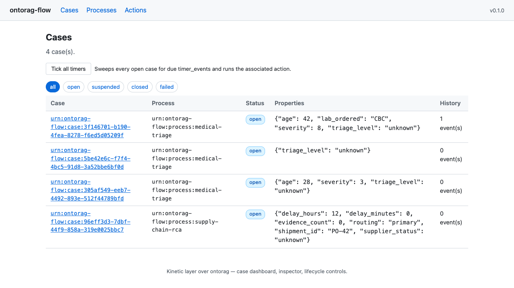
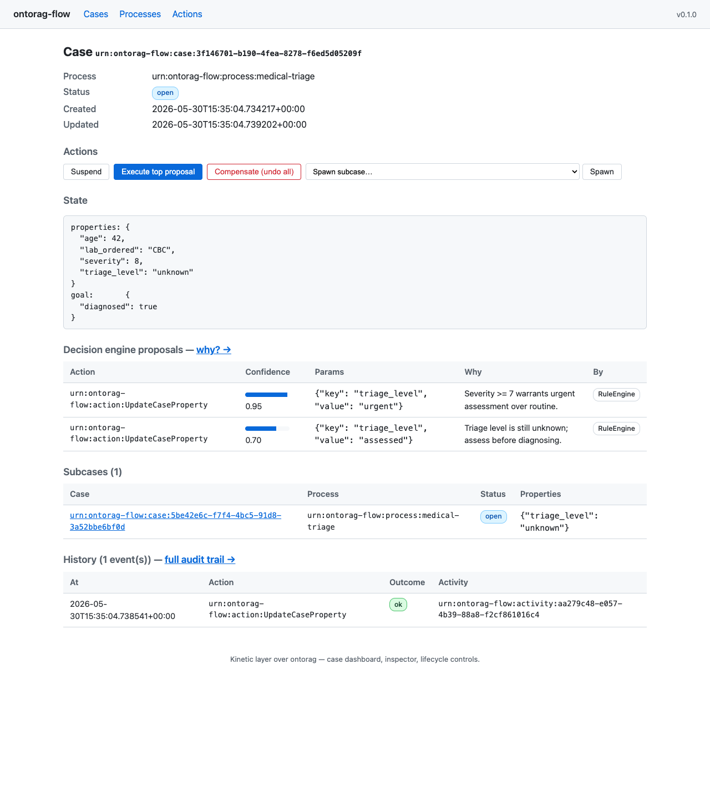
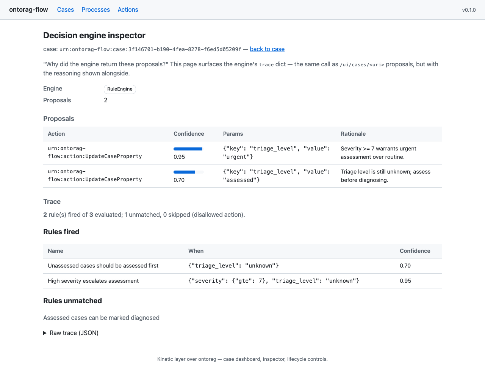
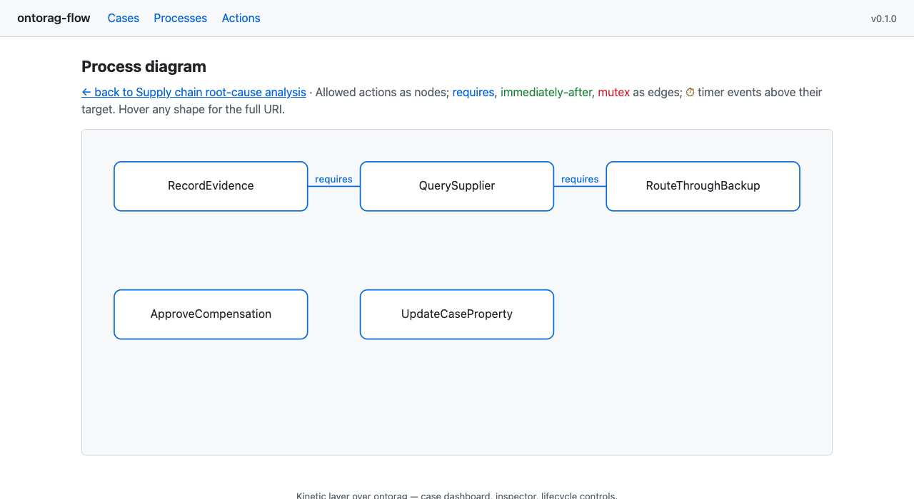
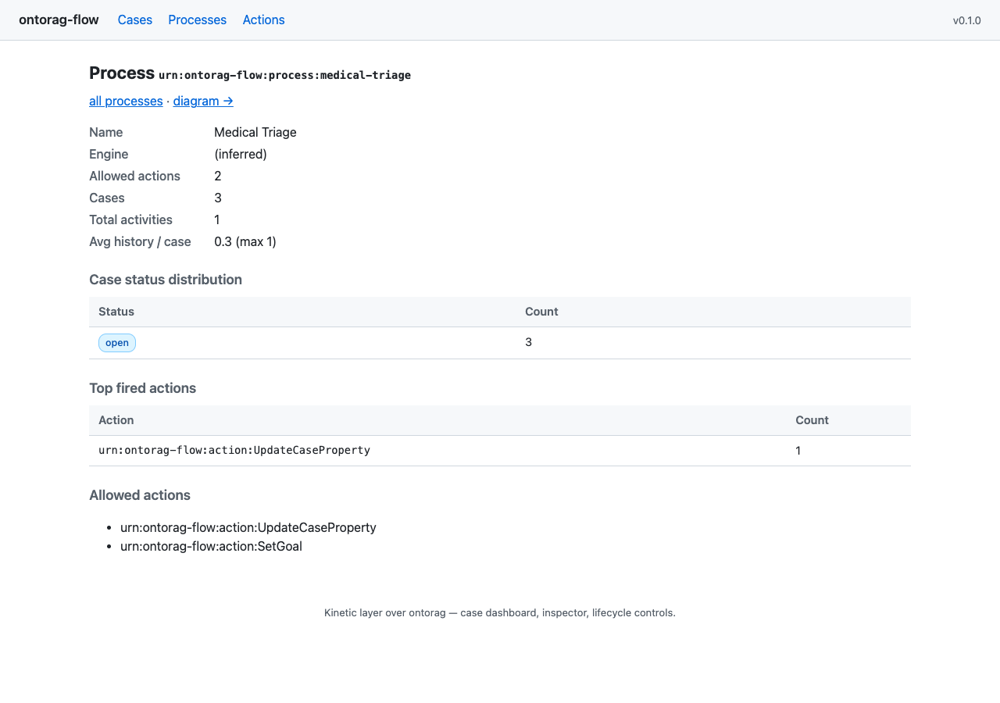
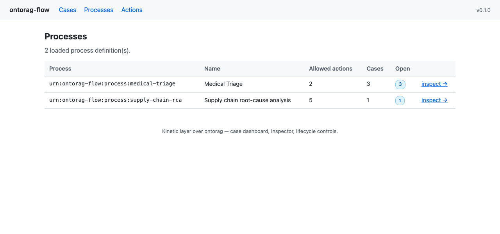
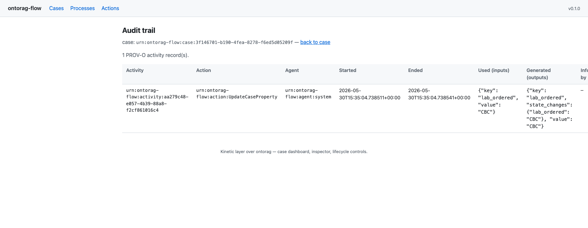

# ontorag-flow

> **[English](README.md) | 한국어**


> ⚠️ **개인 탐구용 프로젝트입니다. 지원되는 제품이 아닙니다.** ontorag-flow는
> 온톨로지 기반 적응형 케이스 관리를 평가하기 위한 1인 오픈소스 프로젝트입니다.
> MIT 라이선스로 자유롭게 fork / 읽기 / 적용 가능하지만, **프로덕션 지원 없음,
> SLA 없음, 하위 호환성 보장 없음** 입니다. 사용 시 commit 을 pin 하고, 자체
> threat model 로 검증한 뒤, fork 를 직접 소유해 운영하세요. Issue / PR 은
> best-effort 로 확인합니다.

> **온톨로지 기반 적응형 케이스 관리(Adaptive Case Management) — [ontorag](https://github.com/ontorag) 위의 Kinetic 레이어.**
> ontorag가 *"무엇이 있고 우리가 무엇을 믿는가"* 라면, ontorag-flow는 *"그것에 대해 무엇을 할 것인가"* 입니다.

```
┌─────────────────────────────┐   ┌──────────────────────────────┐
│  ontorag                    │   │  ontorag-flow  (이 저장소)    │
│  ─────────                  │   │  ─────────────                │
│  Semantic  OWL/RDF          │   │  Kinetic   Actions            │
│  Dynamic   Bayesian / Causal│ ← │  Dynamic   Orchestration      │
│  세상에 대한 추론             │ → │  세상에 대한 행동             │
└─────────────────────────────┘   └──────────────────────────────┘
              ↑                                 ↑
              └────────────  MCP  ──────────────┘
```

오픈소스 **Palantir 스타일 3-레이어 온톨로지 스택**: ontorag가 추론하고,
ontorag-flow가 행동하며, 둘은 [MCP](https://modelcontextprotocol.io)로
대화합니다.

---

## BPM ↔ ACM 스펙트럼 어디인가

```
   BPM (prescriptive)           ←—— spectrum ——→        ACM (adaptive)
   ─────────────────                                    ────────────
   "정확히 이 시퀀스대로"                                  "이 액션들이 허용된다,
                                                          엔진이 runtime에 결정"
   Camunda / Activiti                 ontorag-flow              CMMN / Palantir
                                          ↑
                                기본: ACM-leaning
                                다이얼은 다음으로 돌림:
                                - DecisionEngine 선택 (7가지 플러그형)
                                - constraints (requires / immediately_after / mutex / at_most_once)
                                - skeleton (선택적 happy path)
                                - 규칙 confidence 컷오프
```

**같은 case manager, 같은 감사, 같은 lifecycle. 다이얼은 프로세스
YAML에 있습니다.** 같은 runtime에 3 위치:

- **가장 BPM-like** — `engine: rule`, 모든 규칙 `confidence: 1.0`,
  `constraints.immediately_after`가 모든 액션 chain, `skeleton:`이
  happy path 명시. 모든 것을 PROV-O로 기록하는 *state-machine*처럼
  보임.
- **기본 (ACM-leaning)** — 엔진이 추천, 운영자가 *Execute top
  proposal* 클릭; `constraints`가 불법 move 차단; `skeleton`은 advisory
  (이탈 시 audit에 *표시*되지만 막지 않음).
- **가장 ACM-like** — `engine: llm` / `engine: causal`, `skeleton`
  없음, `immediately_after` 없음. 엔진이 case state를 reasoning하고
  `allowed_actions`에서 선택, 운영자 승인.

ACM이 *유일한 모드가 아닌 기본*인 세 가지 이유:

1. **LLM이 결정자이지 오케스트레이터가 아님.** pre-baked BPMN 그래프는
   *결정자 부재의 대용품*이었습니다 — LLM이 loop에 들어오면 그래프는
   증발합니다.
2. **온톨로지가 가드레일이지 spec이 아님.** TBox 클래스 + DL 제약이
   이미 *coherent한 것*을 정의합니다; BPMN gateway로 다시 인코딩하는 건
   이중 부기.
3. **Goal-driven이 LLM 사고와 일치.** "Diagnosed = true"는 LLM이
   context 가로질러 들고 갈 수 있는 타깃; "node 5로 advance"는 LLM이
   reasoning과 별도로 들고 다녀야 하는 부기.

**Provenance가 BPM의 가장 강한 주장에 답하는 방식입니다.** BPM은
"다이어그램을 replay해서 무엇이 일어났어야 하는지 보기"에서 승리합니다.
ACM은 그것을 *동등하게* 충족하고 더 나아갑니다: 모든 action이 agent /
inputs / outputs / `wasInformedBy` chain이 있는 PROV-O Activity를 기록;
`explain()` opt-in한 엔진은 reasoning trace 기록 (발화된 규칙, posterior
breakdown, 정확한 LLM prompt + raw reply). 적응형 *과 함께* 완전한
forensic recall, opt-out 없음. 자세히는
[Philosophy →](https://nuri428.github.io/ontorag-flow/ko/philosophy/).

---

## 60초 퀵스타트

```bash
git clone <this-repo>
cd ontorag-flow
uv sync --extra dev

# 참조 데모 (합성 환자 케이스가 자동 종료됨)
uv run python examples/medical_triage/run_demo.py

# HTTP API + Web UI (조회 + 변경: suspend/resume/compensate/subcase/tick + counterfactual + inspector)
uv run ontorag-flow serve
#   →  http://localhost:8100/ui/                     (대시보드, Tick all timers)
#   →  http://localhost:8100/ui/cases/<uri>          (lifecycle 버튼, subcase 트리)
#   →  http://localhost:8100/ui/cases/<uri>/explain  (엔진 inspector — "왜?")
#   →  http://localhost:8100/ui/cases/<uri>/audit    (PROV-O + Counterfactual 링크)
#   →  http://localhost:8100/docs                    (OpenAPI)
#   →  http://localhost:8100/mcp                     (MCP transport)

# 또는 CLI에서 모두 구동
uv run ontorag-flow process load examples/medical_triage/process.yaml
uv run ontorag-flow case create urn:ontorag-flow:process:medical-triage \
    -s severity=8 -s age=42
uv run ontorag-flow case propose-next <case_uri>
```

데모는 rule engine의 추론을 단계별로 출력하고, 케이스가 목표 도달 시 자동
종료되는 것을 보여주며, PROV-O Turtle 감사 trail을 내보냅니다.

---

## 스크린샷

라이브 ontorag MCP 서버(`localhost:8011`) 에 연결한 상태로, 두 참조
프로세스가 로드되고 케이스 하나가 실행 중인 상황을 캡쳐.

### 대시보드 — 모든 케이스, 상태 필터, "Tick all timers"



### 케이스 detail — lifecycle 버튼, state, proposals ("why?" 링크), subcases, history



### Decision engine inspector — fired/unmatched 규칙, confidence bar, raw trace fold



### 프로세스 다이어그램 — CMMN 스타일 inline SVG: actions, `requires` / `mutex` / `immediately_after` edges, ⏱ timer events



### 프로세스 inspector — 프로세스별 상태 분포 + 모든 케이스 가로질러 가장 자주 발화한 actions

 

### 감사 추적 — 행별 `Counterfactual` 링크가 있는 PROV-O activities



---

## 무엇을 얻는가

| 기능 | 위치 |
|---|---|
| 부수효과 선언이 포함된 Action 프로토콜 (validate / execute / compensate / audit) | `core/action.py` |
| 불변 `Case` + 상태 머신 (open/suspended/closed/failed), parent/subcase 연결 | `core/case.py` |
| CMMN 기반 `ProcessDefinition` (YAML 또는 RDF/Turtle/JSON-LD) | `core/process.py`, `core/process_rdf.py` |
| `CaseManager` — execute → state apply → audit 오케스트레이션, saga compensation, suspend/resume/fork, subcase 트리, timer events, 순서 제약 (mutex / requires / immediately_after / at_most_once), human handoff | `core/case_manager.py` |
| **6개의 플러그형 결정 엔진** — YAML에서 선언 가능한 `StackedEngine` 포함 — 아래 표 참고 | `engines/` |
| `EngineResolver`를 통한 프로세스별 엔진 선택 (`engine: stacked` arbitration 포함) | `engines/selection.py` |
| 선택적 **`engine.explain()`** — 엔진별 reasoning trace | `engines/base.py` + 각 엔진 |
| 영속성: SQLite (개발) 및 Postgres (운영), 동일 Protocol, optimistic locking | `stores/sqlite.py`, `stores/postgres.py` |
| Web UI — `Tick all timers`가 있는 케이스 대시보드, case-detail의 mutating 버튼 (Suspend / Resume / Compensate / Execute top proposal / Spawn subcase), 엔진 inspector (`/explain`), counterfactual replay (`/counterfactual`), audit 뷰 | `ui/` |
| FastAPI REST + `fastapi-mcp` — 모든 operation이 MCP tool이기도 함 | `api/` |
| 내장 액션: case-state, human-review, 그리고 ontorag MCP를 통한 **ABox write-back** (`AssertTriple` / `RetractTriple`) | `actions/` |
| PROV-O / DCAT 감사 export — JSON-LD 또는 Turtle | `core/provenance.py` |

## 결정 엔진

| 엔진 | 어떻게 액션을 고르는가 | 백킹 클라이언트 | 프로세스 설정 필드 |
|---|---|---|---|
| `RuleEngine` | 선언적 결정 테이블 (연산자: `eq/ne/gt/gte/lt/lte/in/exists`) | 없음 | `rules:` |
| `BayesianMpeEngine` | ontorag로부터 `P(goal \| evidence ∪ candidate.evidence)` | ontorag MCP (v0.7) | `bayesian:` |
| `CausalSimulationEngine` | `P(goal \| do(intervention))` — Pearl Rung 2 | ontorag MCP (v0.8) | `causal:` |
| `LlmAgentEngine` | 케이스 상태 + 액션 카탈로그에 대한 LLM 추론 (Anthropic / OpenAI / Ollama) | LLM SDK | `engine: llm` |
| `HumanReviewEngine` | 항상 사람에게 위임; 결과로 나오는 `RequestHumanReview` 액션은 케이스를 자동 suspend | 없음 | `engine: human` |
| `StackedEngine` | proposer (rule / bayesian / llm / human) + causal engine을 최종 validator로 합성 | proposer의 client + ontorag MCP (v0.8) | `engine: stacked` + `arbitration: {proposer, validator}` |

프로세스 YAML에서 `engine: <kind>`로 명시적으로 선택하거나, resolver에게
추론을 맡깁니다 (`causal:` 존재 → causal, `bayesian:` → bayesian,
`rules:` → rule, 그 외엔 기본값).

---

## MCP surface — 외부 호출자가 보는 것

ontorag-flow는 `fastapi-mcp`를 마운트하므로 이름 있는 모든 REST operation이
MCP tool이 됩니다. 자매 저장소(특히 umbrella `ontorag-aip-demo`)는 HTTP를
몰라도 MCP만으로 전체 스택을 구동할 수 있습니다:

| Tool (`operation_id`) | 무엇을 하는가 |
|---|---|
| `health_check` | 서비스 liveness |
| `list_actions` | 등록된 액션 카탈로그 |
| `load_process` / `list_processes` / `get_process` | 프로세스 registry |
| `create_case` / `get_case_state` / `find_cases` | 케이스 lifecycle 조회/생성 |
| `execute_action` | 선택한 액션을 케이스에 실행 |
| `propose_next_action` | 결정 엔진 추천 (실행 안 함) |
| `compensate_case` / `suspend_case` / `resume_case` / `fork_case` | 적응형 케이스 관리 |
| `create_subcase` | 부모 아래 자식 케이스 생성 (subprocess 연결) |
| `tick_timers` | 모든 열린 케이스에서 만기된 timer event 발화 |
| `counterfactual_replay` | "이 단계에서 Y였다면?" — ontorag causal로 |
| `get_audit_trail` | 케이스의 PROV-O activities |

ontorag-flow는 ontorag 자체의 **MCP 클라이언트**이기도 합니다 — typed
wrapper는 `ontorag_client/tools.py` 참고 (`find_entities`,
`describe_entity`, `get_schema`, `compute_posterior`, `do_query`,
`counterfactual`, `assert_triple`, `retract_triple`).

---

## 설정

`.env.example`를 `.env`로 복사하고 편집하세요. 주요 노브:

| 변수 | 기본값 | 의미 |
|---|---|---|
| `ONTORAG_MCP_URL` | `http://localhost:8000/mcp` | 자매 ontorag 서버 |
| `CONNECT_ONTORAG` | `false` | 시작 시 ontorag 연결 (Bayesian/Causal 엔진 활성화) |
| `LLM_PROVIDER` | unset | `anthropic` / `openai` / `ollama` — `LlmAgentEngine` 활성화 |
| `LLM_MODEL` | provider 기본 | 모델 override |
| `DATABASE_PATH` | `ontorag_flow.db` | SQLite 파일 (또는 `postgres` extra를 통해 Postgres 사용) |
| `AGENT_ID` | `urn:ontorag-flow:agent:system` | 모든 audit activity의 `prov:wasAssociatedWith` |

## 선택적 extras

```bash
uv sync --extra dev                       # tests + ruff + pyright + bandit + testcontainers
uv sync --extra dev --extra llm           # + Anthropic / OpenAI SDK
uv sync --extra postgres                  # + asyncpg (운영)
```

## Docker

multi-stage `Dockerfile` (Python 3.12-slim, `uv`-build된 venv, non-root
사용자, stdlib `/health` healthcheck)이 저장소에 포함되어 있습니다. 최종
이미지는 코어 의존성만 약 230 MB.

```bash
# 컨테이너 내 SQLite 스토어로 build + run
docker compose up

#   →  http://localhost:8100/ui/      (read-only inspector)
#   →  http://localhost:8100/docs     (OpenAPI)
#   →  http://localhost:8100/health   (liveness)

# SQLite 대신 Postgres profile
docker compose --profile postgres up

# build 시점에 선택적 extras 추가
docker build --build-arg INSTALL_EXTRAS="postgres llm" -t ontorag-flow:full .
```

자매 `ontorag` 서버의 compose 파일과 함께 띄워 default 네트워크를 공유하면
`ONTORAG_MCP_URL`이 서비스 이름으로 해석됩니다:

```bash
docker compose -f docker-compose.yml -f ../ontorag/docker-compose.yml up
# 그 다음 docker-compose.yml에 CONNECT_ONTORAG=true를 설정해 Bayesian/Causal
# 엔진을 활성화하세요.
```

## 레이아웃

```
src/ontorag_flow/
├── core/         Action / Case / Process (+ RDF) / Executor / Audit / CaseManager / Registry
├── engines/      DecisionEngine Protocol + EngineExplanation + 5 base + StackedEngine + Resolver
├── ontorag_client/  MCP 클라이언트 (단일 공유 연결) + typed tool wrappers (assert_triple 포함)
├── stores/       SqliteStore + PostgresStore (동일 Protocol, 교체 가능, optimistic locking)
├── actions/      내장 액션 — case-state, human, 그리고 ABox write-back (Assert/RetractTriple)
├── api/          FastAPI 앱 + 라우트 + fastapi-mcp 마운트
├── ui/           Jinja2 UI — 대시보드 (tick), case detail (mutating 버튼 + subcase 트리), explain inspector, counterfactual, audit
└── cli.py        Typer CLI
examples/
├── medical_triage/      참조 end-to-end 데모 (RuleEngine, 자동 종료 케이스)
├── supply_chain_rca/    두 번째 도메인 데모 — RuleEngine + 선택적 LLM 변형
└── bayesian_demo/       작은 fake ontorag MCP fixture 위의 Bayesian engine
docs/operator-guide.md   운영자 가이드 (EN + KO 이중 언어)
```

---

## `ontorag`와 함께 작업

ontorag-flow는 action 측, ontorag는 reasoning 측입니다. 풀스택은 둘을 함께
구동하세요:

```bash
# ontorag (자매 저장소) — 예: http://localhost:8000/mcp 에 MCP 노출
ontorag serve

# ontorag-flow — ontorag를 consume하고 자체 MCP를 노출
CONNECT_ONTORAG=true ontorag-flow serve
```

`CONNECT_ONTORAG=true` 이고 ontorag v0.7+/v0.8+가 닿을 수 있으면 Bayesian /
Causal 엔진이 사용 가능해집니다; 그렇지 않으면 local-only 엔진(rule, llm,
human)만 동작합니다.

### Integration 테스트

라이브 ontorag 인스턴스와 Fuseki가 필요한 테스트는 `integration` 마크로 표시되며
기본값으로 제외됩니다:

```bash
# 유닛 테스트만 (라이브 백엔드 불필요)
uv run pytest -m "not integration"

# 라이브 ontorag HTTP MCP(localhost:8000) + Fuseki(localhost:3030) 포함 전체 실행
ontorag serve &          # ontorag를 먼저 실행
uv run pytest -m integration
```

`integration` 마크 대상:
- `AssertTriple` / `RetractTriple` ABox write-back via ontorag HTTP MCP
- Saga 보상 (롤백 시 retract, 역방향 롤백 시 re-assert)
- `PostgresStore` 라운드트립 (`docker compose --profile postgres up` 필요)

## 예제 & 도구

"이 저장소로 무엇을 할 수 있고 어떻게 하는가"의 압축 지도. 자세한 동작은
모든 CLI 명령의 `--help` 와 inline docstring에 있고, 이 섹션은 index입니다.

#### 실행 가능한 예제 (use case)

| 하고 싶은 것 | 위치 | 보여주는 것 |
|---|---|---|
| 결정 트리로 케이스 자동 종료 | `examples/medical_triage/run_demo.py` | `RuleEngine`, 목표 도달 시 자동 close, PROV-O Turtle 내보내기 |
| 사람 개입이 있는 개방형 조사 | `examples/supply_chain_rca/run_demo.py` | 커스텀 도메인 액션, `EXTERNAL_API`/`HUMAN` 부수효과, `requires` 제약, 자동 suspend → resume → close |
| 같은 프로세스를 LLM 엔진으로 (fake 또는 live) | `examples/supply_chain_rca/run_demo_llm.py` | `LlmAgentEngine`, 코드 안에서 `engine: llm` override, hallucinated URI는 allowed 필터로 차단 |
| 보상(saga 롤백) | `ontorag-flow case compensate <case_uri>` | `action.compensate` 훅, `state_before`로 상태 복원, audit는 모든 이벤트 보존 |
| 반사실 "Y였다면?" 시뮬레이션 | `ontorag-flow case counterfactual ...` | `CausalSimulationEngine` via ontorag MCP (ontorag v0.8 필요) |
| 라이브 PostgreSQL 백엔드 | `docker compose --profile postgres up` + `tests/test_postgres_store_integration.py` | `PostgresStore` round-trip via testcontainers |
| UI에서 케이스/액션/감사 둘러보기 | `ontorag-flow serve` → `http://localhost:8100/ui/` | `Tick all timers`, 상태 필터, 케이스 링크가 있는 라이브 대시보드 |
| 브라우저에서 lifecycle 직접 운용 | `/ui/cases/<uri>` → Suspend / Resume / Execute top proposal / Compensate / Spawn subcase | Form POST + 303 redirect 패턴, JS-free; 상태별 conditional 버튼 |
| "왜 엔진이 그것을 추천했나?" 진단 | `/ui/cases/<uri>/explain` | `engine.explain()` 을 engine-specific 카드로 (규칙-발화 표 / posterior 막대 / LLM prompt / proposer-vs-validator 비교) |
| 과거 activity를 swap해서 재생 | `/ui/cases/<uri>/audit` → 행의 "Counterfactual" 링크 | causal engine에 대한 read-only "Y였다면?" 폼 |
| YAML에서 proposer + causal validator 합성 | `engine: stacked` + `arbitration: {proposer: rule\|bayesian\|llm\|human, validator: causal}` | 두 엔진 arbitration을 모델에 선언, Python wiring 불필요 |
| 프로세스를 YAML 대신 RDF로 정의 | `ontorag-flow process load <process.ttl\|process.jsonld>` | `urn:ontorag-flow:process#` vocabulary, engine / causal / constraints / timer_events / arbitration 전 필드 round-trip |
| ontorag ABox에 트리플 write-back | `allowed_actions` 에 `AssertTriple` / `RetractTriple` (live `OntoragClient` 필요) | `ABOX_WRITE` 부수효과 + 롤백 시 retract하는 saga `compensate` |
| YAML 저장 없이 process 작성 반복 | `ontorag-flow process simulate <yaml> -s K=V [--execute-top] [--explain]` | in-memory 케이스 + 엔진 호출; 옵션으로 top proposal 실행 + explain trace 출력 |
| Action을 Python 플러그인으로 배포 | 패키지의 `pyproject.toml`에 `[project.entry-points."ontorag_flow.actions"]` 선언 | `default_registry()`가 부팅 시 발견; 깨진 플러그인은 fatal 없이 로그하고 skip |

#### CLI 도구

| 명령 | 용도 |
|---|---|
| `ontorag-flow init` | `.env.example`에서 `.env` 부트스트랩 |
| `ontorag-flow status` | 설정 + ontorag MCP 연결 점검 표시 |
| `ontorag-flow serve` | FastAPI + MCP 서버 실행 (`/ui`, `/mcp`, REST 마운트) |
| `ontorag-flow action list / register / run` | 액션 카탈로그 보기, 플러그인 등록, ad-hoc 실행 |
| `ontorag-flow process load / list` | YAML(또는 Turtle) 프로세스 로드 및 조회 |
| `ontorag-flow process simulate <yaml> -s K=V` | in-memory 케이스로 엔진 dry-run — 작성자가 dev DB 오염 없이 반복 검증 |
| `ontorag-flow case create / status` | 케이스 생성 + 상태/히스토리/상태값 표시 |
| `ontorag-flow case propose-next` | 실행하지 않고 결정 엔진 추천만 받기 |
| `ontorag-flow case execute` | 선택한 액션을 케이스에 실행 |
| `ontorag-flow case compensate` | 실행된 액션 꼬리를 saga 방식으로 롤백 |
| `ontorag-flow case suspend / resume` | 케이스 일시 정지 / 재개 |
| `ontorag-flow case fork` | 소스 케이스의 상태+히스토리를 복사한 새 케이스 |
| `ontorag-flow case subcase` | 부모 아래 자식 케이스 생성 (자식 종료 시 부모 state로 투영) |
| `ontorag-flow case tick` | 모든 열린 케이스에 대해 만기된 타이머 발화 |
| `ontorag-flow case counterfactual` | "이 단계에서 Y였다면?"을 causal 엔진으로 |
| `ontorag-flow audit show / export` | PROV-O 감사 trail 조회 / 렌더링 (JSON-LD · Turtle) |

#### 결정 엔진 (프로세스의 `engine:`로 선택, 미지정 시 resolver 추론)

| 엔진 | 언제 쓰는가 | 백킹 클라이언트 |
|---|---|---|
| `RuleEngine` | 도메인이 결정 테이블로 표현 가능, 외부 서비스 불필요 | 없음 |
| `BayesianMpeEngine` | 관측적 `P(goal \| evidence)` 필요 | ontorag MCP (v0.7) |
| `CausalSimulationEngine` | 개입적 `P(goal \| do(...))` 필요 — Pearl Rung 2 | ontorag MCP (v0.8) |
| `LlmAgentEngine` | 개방형 가설 공간, 자유로운 추론 | Anthropic / OpenAI / Ollama |
| `HumanReviewEngine` | 항상 사람 검토자에게 위임 | 없음 |
| `StackedEngine` | proposer + causal validator 합성 — YAML에 `engine: stacked` + `arbitration: {proposer: rule\|bayesian\|llm\|human, validator: causal}` 로 선언 | proposer의 client + ontorag MCP |

#### 내장 액션

| 액션 URI | 부수효과 | 동작 |
|---|---|---|
| `urn:ontorag-flow:action:UpdateCaseProperty` | CASE_STATE | 케이스 상태에 속성 하나를 설정 |
| `urn:ontorag-flow:action:SetGoal` | CASE_STATE | 목표 술어를 선언 / 교체 |
| `urn:ontorag-flow:action:RequestHumanReview` | HUMAN + CASE_STATE | 사람 검토 대상으로 표시 — 자동 suspend |
| `urn:ontorag-flow:action:AssertTriple` | ABOX_WRITE | ontorag의 ABox에 (s, p, o) 트리플 하나를 기록 (OntoragClient가 살아 있을 때만 등록) |
| `urn:ontorag-flow:action:RetractTriple` | ABOX_WRITE | ontorag의 ABox에서 (s, p, o) 트리플 하나를 제거 (AssertTriple과 서로 saga-compensate) |

---

## 더 읽기

- [`docs/operator-guide.md`](docs/operator-guide.md) — 브라우저 UI를 위한
  **운영자 가이드** (EN + KO). 각 lifecycle 버튼이 무엇을 하는지, error
  callout 해석 방법, 자주 만나는 시나리오, counterfactual replay, 엔진
  inspector, 그리고 UI가 *의도적으로 하지 않는* 것.
- [`docs/operations.md`](docs/operations.md) — SQLite / Postgres 배포의
  **백업 / 복원 / 재해 복구** (EN + KO), 운영자가 시스템을 다시 열기 전
  실행할 사후 복원 smoke flow 포함.
- [`docs/security.md`](docs/security.md) — **위협 모델 + 7가지 hardening
  표면** (anti-injection, confidence cap, execute policy, transport
  trust, cascade health, audit redact, plugin allowlist), 그리고
  *의도적으로 방어하지 않는* 것들 (auth, RBAC — reverse-proxy 책임).
  EN + KO.
- [`CLAUDE.md`](CLAUDE.md) — 프로젝트 사양, 아키텍처 근거, milestone 계획,
  anti-pattern, **v1.x를 위한 알려진 위험** (history bloat, write-ahead
  audit), 그리고 어떤 *Open question*들이 **DECIDED** vs **PARTIAL**인지의
  진행 기록.
- [`examples/medical_triage/`](examples/medical_triage/) — 참조 end-to-end
  데모 + 이 README의 quickstart가 사용하는 YAML 프로세스.
- [`examples/supply_chain_rca/`](examples/supply_chain_rca/) —
  `EXTERNAL_API` / `HUMAN` 부수효과를 보여주는 두 번째 도메인 데모, LLM
  변형 (`run_demo_llm.py`) 포함.
- [`examples/bayesian_demo/`](examples/bayesian_demo/) — in-process fake
  ontorag MCP fixture에 대해 Bayesian 엔진 구동.

## 관련 프로젝트

| 레포 | 레이어 | 역할 |
|---|---|---|
| [ontorag](https://github.com/nuri428/ontorag) | Semantic + Dynamic | RDF/OWL 그래프 · Bayesian · Causal · MCP 툴 |
| **ontorag-flow** *(이 레포)* | Kinetic | 적응형 케이스 관리 · 액션 오케스트레이션 · PROV-O 감사 로그 |
| [ontorag-memory](https://github.com/nuri428/ontorag-memory) | 에이전트 메모리 | Claude Code, Hermes 등 MCP 에이전트를 위한 온톨로지 기반 장기 메모리 |

## 라이선스

MIT. ontorag와 동일.
